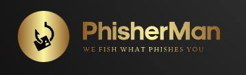
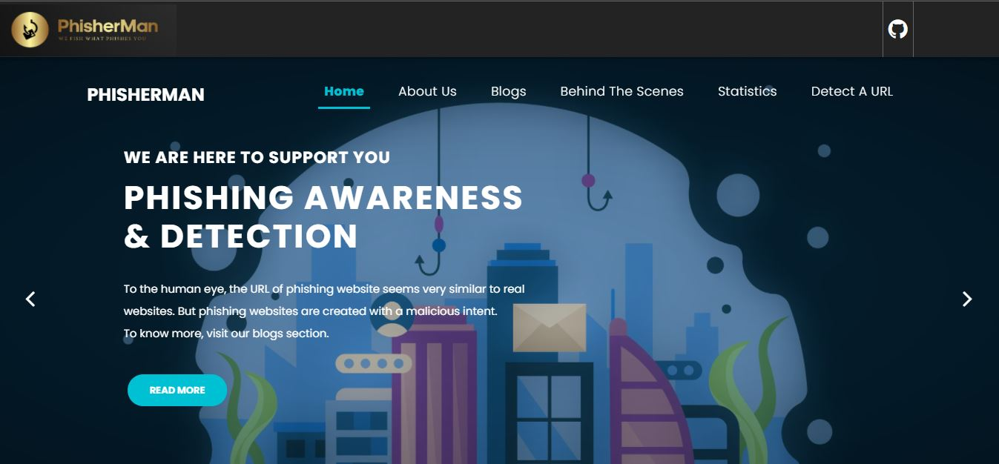
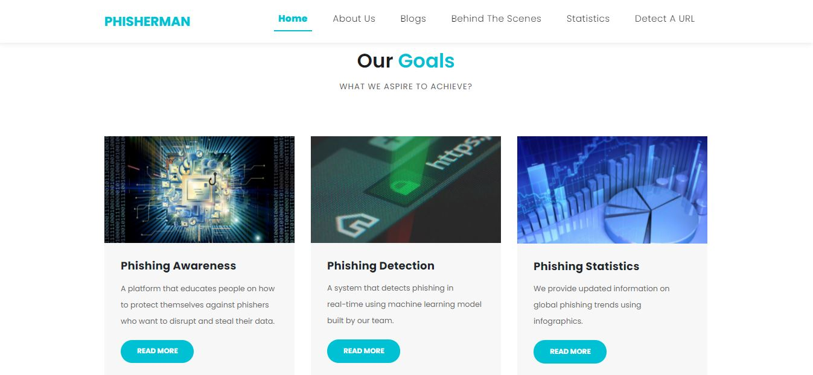
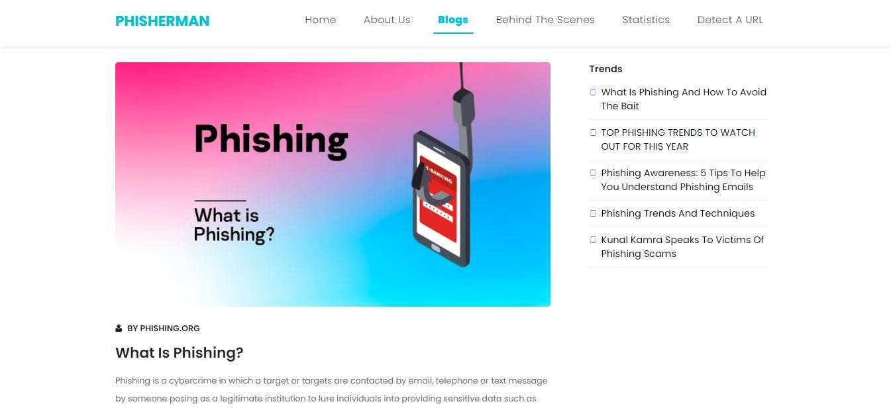
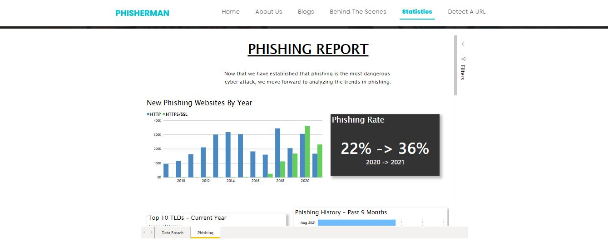
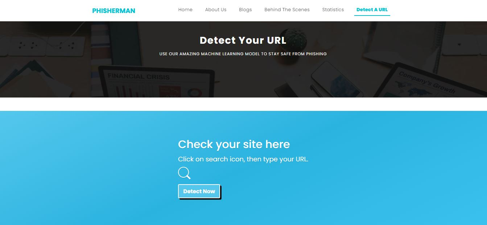
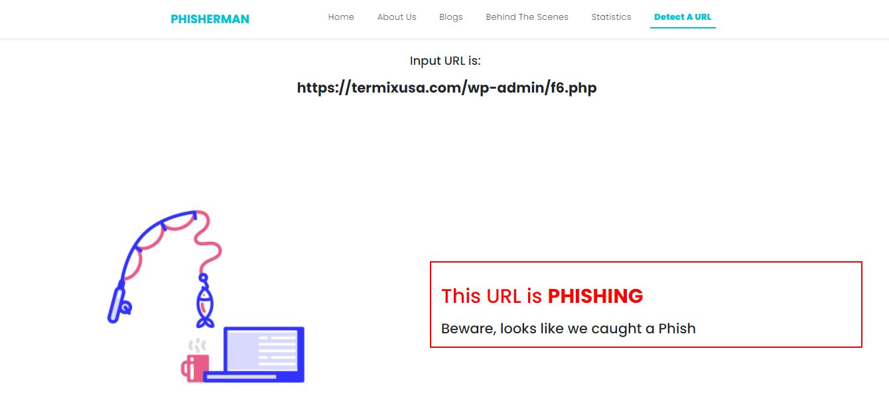
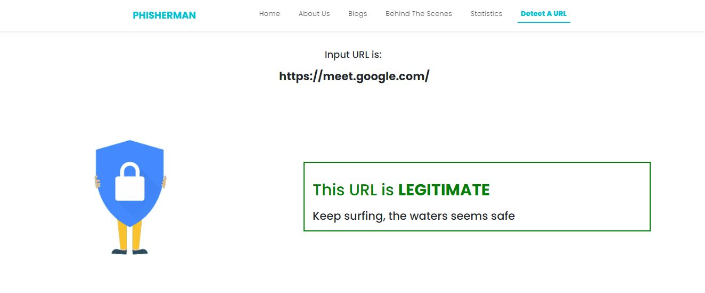

[![MIT License][license-shield]][license-url]
[![LinkedIn][linkedin-shield]][linkedin-url]

<!-- PROJECT LOGO -->
 

  

  <h3 align="center">PhisherMan</h3>

  

    We Fish What Phishes YOU!!
     
     
    <a href="https://phisherman-urldetection.herokuapp.com/">View Demo</a>
    ·
    <a href="https://github.com/Himank-J/">Report Bug</a>
    ·
    <a href="https://github.com/Himank-J/">Request Feature</a>
  

<!-- TABLE OF CONTENTS -->
## Table of Contents

* [About the Project](#about-the-project)
  * [Built With](#built-with)
* [Features](#features)
* [Purpose](#purpose)
* [Contributing](#contributing)
* [License](#license)
* [Contact](#contact)

<!-- ABOUT THE PROJECT -->
## About The Project

 

Are you tired of thinking of the right caption or the perfect filter for your photos? If you are, then StaySocial is here for you! StaySocial is the most simple and easy to use platform to share your stroies with the world. StaySocial is a social media application that promotes users to live in the moment and share a part of that moment with their friends and families in form of short stories that they create. So now no more worrying about the right picture, just StaySocial and share your life!

### Built With
This application is built with love, dedication, coffee and:
* **M**ongoDB - Database Management
* **E**xpress - Javascript framework designed for building web applications and APIs
* **R**eact JS - front-end JavaScript library for building user interfaces or UI components
* **N**ode JS - open-source, cross-platform, back-end JavaScript runtime environment

App url - https://staysocial.netlify.app/   
Visit now, create your account and start sharing.

<!-- Features -->
# Features
* Simple and easy to use platform
* Users can create their account by registering to StaySocial
* Google Authentication configured for registering or signing in users.
* Proper login authetication
* Create, Update, Delete or Like stories 

<!-- Purpose -->
## Purpose 
The purpose of this project is to implement MERN stack to develop a social media application where users can share their moments in form of short stories. This project is great learning step for anyone wanting to work with MERN stack and understanding how different components of mern stack interact with each other and how is flow between each component.
This project helped me - 
* Understand express for routing services
* master API calls using axios
* Configure MongoDB Atlas which is a cloud interface for database management
* develop beautiful front-end using React JS   

<!-- CONTRIBUTING -->
## Contributing

Contributions are what make the open source community such an amazing place to be learn, inspire, and create. Any contributions you make are **greatly appreciated**.

1. Fork the Project
2. Create your Feature Branch (`git checkout -b feature/AmazingFeature`)
3. Commit your Changes (`git commit -m 'Add some AmazingFeature'`)
4. Push to the Branch (`git push origin feature/AmazingFeature`)
5. Open a Pull Request

<!-- LICENSE -->
## License

Distributed under the MIT License. See `LICENSE` for more information.

<!-- CONTACT -->
## Contact

Himank Jain - [callme__hj](https://instagram.com/callme__hj) - My Instagram  
Himank Jain - [himank-jain](https://www.linkedin.com/in/himank-jain/) - My LinkedIn   
Project Link: [https://github.com/Himank-J/StaySocial](https://github.com/Himank-J/StaySocial)

<!-- MARKDOWN LINKS & IMAGES -->
<!-- https://www.markdownguide.org/basic-syntax/#reference-style-links -->

[license-shield]: https://img.shields.io/github/license/othneildrew/Best-README-Template.svg?style=flat-square
[license-url]: https://github.com/othneildrew/Best-README-Template/blob/master/LICENSE.txt
[linkedin-shield]: https://img.shields.io/badge/-LinkedIn-black.svg?style=flat-square&logo=linkedin&colorB=555
[linkedin-url]: https://www.linkedin.com/in/himank-jain/
[product-screenshot]: images/search.png

